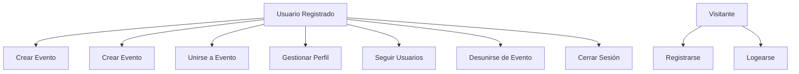
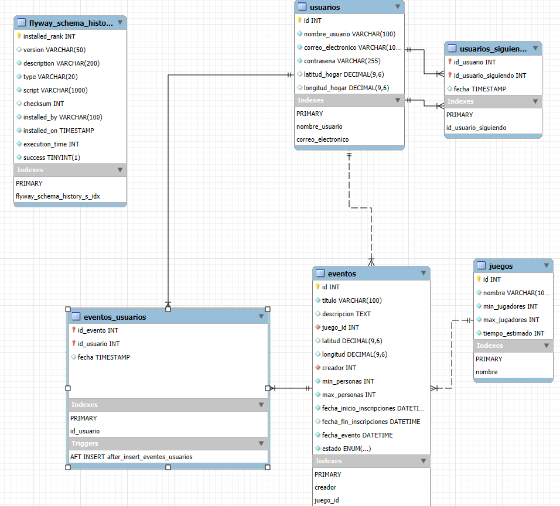
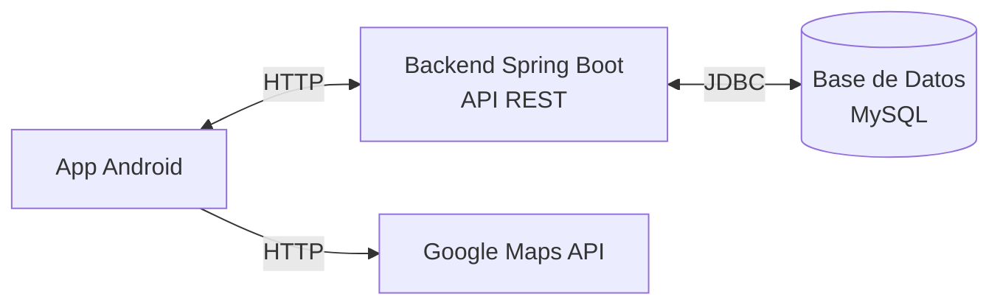
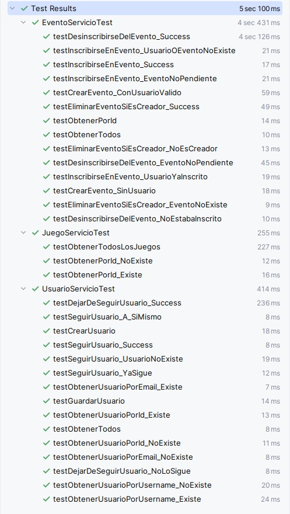
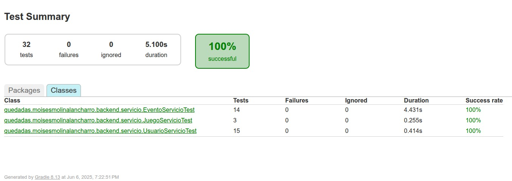
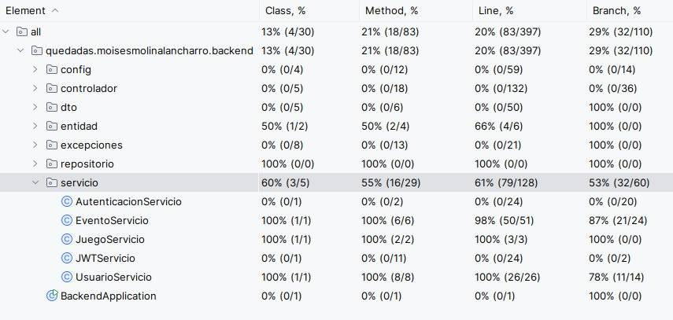

# **QuedadasBoardGames**
## *Conectando jugadores, creando comunidades*

### Desarrollo de Aplicaciones Multiplataforma (DAM)
#### Alumno: **Moisés Molina Lancharro**

---

*Aplicación Android para la organización de eventos de juegos de mesa*

---

## 📑 Índice

1. [Introducción al Proyecto](#introducción-al-proyecto)
2. [Diagrama de Casos de Uso](#diagrama-de-casos-de-uso)
3. [Diagrama de Clases](#diagrama-de-clases)
4. [Diagrama Entidad-Relación](#diagrama-entidad-relación)
5. [Diagrama de Componentes](#diagrama-de-componentes)
6. [Casos de Prueba](#casos-de-prueba)
7. [Tecnologías Utilizadas](#tecnologías-utilizadas)
8. [Conclusiones](#conclusiones)
9. [Referencias y Contacto](#referencias-y-contacto)

---

## Introducción al Proyecto

**QuedadasBoardGames** es una aplicación Android innovadora diseñada para facilitar la organización de eventos de juegos de mesa entre usuarios. La aplicación surge de la necesidad de conectar a los amantes de los juegos de mesa en un entorno digital intuitivo y funcional.

### Características Principales
- ✅ Registro e inicio de sesión seguro
- 📍 Geolocalización de eventos
- 📅 Gestión completa de eventos
- 👥 Sistema de seguimiento entre usuarios
- 🌓 Modo claro/oscuro
- 🔔 Sistema de notificaciones (futuro)

### Justificación del Proyecto
En la era digital actual, los juegos de mesa representan una oportunidad única para reconectar con las relaciones interpersonales. Esta aplicación busca facilitar estos encuentros a través de la tecnología.

---

## Diagrama de Casos de Uso

### Actores del Sistema

- Usuario Registrado
- Visitante

### Casos de Uso Principales



---

## Diagrama de Clases

### Paquete Servicio del backend

```mermaid
classDiagram
class AutenticacionServicio {
    -usuarioServicio: UsuarioServicio
    -passwordEncoder: PasswordEncoder
    -authenticationManager: AuthenticationManager
    +loginUsuario(email: String, password: String): Usuario
    +registrarUsuario(username: String, email: String, contrasena: String, lat: BigDecimal, lng: BigDecimal): Usuario
}
class EventoServicio {
    -eventoRepository: EventoRepository
    -usuarioServicio: UsuarioServicio
    +obtenerPorId(id: int): Optional(Evento)
    +obtenerTodos(): List(Evento)
    +crearEvento(eventoACrear: Evento, email: String): Evento
    +inscribirseEnEvento(idUsuario: int, idEvento: int): boolean
    +desinscribirseDelEvento(idUsuario: int, idEvento: int): boolean
    +eliminarEventoSiEsCreador(idUsuario: int, idEvento: int): boolean
}
class JuegoServicio {
    -juegoRepository: JuegoRepository
    +obtenerTodosLosJuegos(): List(Juego)
    +obtenerPorId(id: int): Optional(Juego)
}
class JWTServicio {
    -secretKey: String
    -jwtExpiration: long
    +extractUsername(token: String): String
    +extractClaim(token: String, Function<Claims, claimsResolver: T>): (T) T
    +generateToken(userDetails: UserDetails): String
    +generateToken(Map<String, extraClaims: Object>, userDetails: UserDetails): String
    +isTokenValid(token: String, userDetails: UserDetails): boolean
    +getExpirationMillisFromToken(token: String): long
}
class UsuarioServicio {
    -usuarioRepository: UsuarioRepository
    +obtenerUsuarioPorId(id: int): Optional(Usuario)
    +crearUsuario(u: Usuario): Usuario
    +obtenerUsuarioPorUsername(username: String): Optional(Usuario)
    +obtenerUsuarioPorEmail(email: String): Optional(Usuario)
    +obtenerTodos(): List(Usuario)
    +seguirUsuario(idSeguidor: int, idSeguido: int): boolean
    +dejarDeSeguirUsuario(idSeguidor: int, idSeguido: int): boolean
    +guardarUsuario(usuario: Usuario): Usuario
}

```



### Descripción de Clases Principales

#### Clase AutenticacionServicio
- Gestiona el registro y el login de usuarios.
- Encargado de validar credenciales, codificar contraseñas y autenticar usuarios usando

#### Clase EventoServicio
- Administra toda la lógica relacionada con los eventos de juegos de mesa
- Crear, obtener, inscribirse, desinscribirse y eliminar eventos, con control de permisos (como si el usuario es el creador).


#### Clase JuegoServicio

- Provee acceso a los juegos disponibles en el sistema.
- Permite consultar todos los juegos registrados o buscar uno por ID.


#### Clase JWTServicio
- Gestiona la creación, validación y análisis de tokens JWT.
- Extrae el usuario del token, valida su autenticidad y calcula su expiración.

#### UsuarioServicio
- Se encarga de la gestión completa de usuarios:
- Crear, buscar por email o nombre de usuario, obtener todos, y también funcionalidades sociales como seguir o dejar de seguir a otros usuarios.

---

## Diagrama Entidad-Relación



## Diagrama de Componentes

### Arquitectura de la Aplicación



## Casos de Prueba

### Listado de tests


### Cobertura




---

## Tecnologías Utilizadas

### Stack Tecnológico

#### Frontend Mobile
```yaml
Plataforma: Android
Lenguaje: Java 17
IDE: Android Studio
```

#### Backend
```yaml
Framework: Spring Boot 3
Lenguaje: Java 17
Base de Datos: MySQL 8.0
Autenticación: JWT + Spring Security
Documentación API: Swagger/OpenAPI 3
```

#### DevOps y Herramientas
```yaml
Contenedores: Docker + Docker Compose
Control de Versiones: Git + GitHub
Diseño: Figma
Testing: JUnit 5, Mockito
```

### Bibliotecas y Dependencias Clave

#### Android
- **Retrofit:** Cliente HTTP
- **Google Maps SDK:** Servicios de mapas
- **Material Design Components:** UI/UX

#### Spring Boot
- **Spring Data JPA:** Persistencia de datos
- **Spring Security:** Autenticación y autorización
- **MySQL Connector:** Driver de base de datos

---

## Conclusiones

### Logros Alcanzados

✅ **Funcionalidad Completa:** Todas las características principales implementadas y funcionando

✅ **Arquitectura Sólida:** Separación clara de responsabilidades y patrones de diseño aplicados

✅ **Experiencia de Usuario:** Interfaz intuitiva con modo claro/oscuro y navegación fluida

✅ **Seguridad:** Autenticación JWT implementada correctamente

✅ **Escalabilidad:** Arquitectura preparada para futuras funcionalidades

### Aprendizajes Clave

- **Integración Full-Stack:** Experiencia completa conectando Android con Spring Boot
- **Geolocalización:** Implementación exitosa de servicios de mapas y ubicación

### Desafíos Superados

- **Desarollo full stack** 
- **Contenerización:** Mediante docker y docker compose
- **Testing Unitario:** Cobertura amplia de casos de prueba

### Trabajo Futuro

🔮 **Funcionalidades Planificadas:**
- Sistema de notificaciones push
- Chat integrado para participantes de eventos
- Sistema de valoraciones y reseñas
- Integración con redes sociales
- Algoritmos de recomendación de eventos

---

## Referencias y Contacto

### Documentación del Proyecto
- **Repositorio GitHub:** [github.com/Cnon88/proyecto_moises_molina_lancharro](https://github.com/Cnon88/proyecto_moises_molina_lancharro)
- **API Documentación:** [Swagger UI](https://actively-glad-roughy.ngrok-free.app/swagger-ui/index.html)
- **Diseño Figma:** [Prototipo UI/UX](https://www.figma.com/design/zPR9ezjQ1QaigbX0xQUPQ0/DiseñoQuedadas)

### Tecnologías y Referencias
- **Spring Boot Documentation:** [spring.io/projects/spring-boot](https://spring.io/projects/spring-boot)
- **Android Developer Guides:** [developer.android.com](https://developer.android.com)
- **Material Design Guidelines:** [material.io/design](https://material.io/design)

### Contacto

**Moisés Molina Lancharro**
- 📧 **Email:** [cnon@hotmail.es](mailto:cnon@hotmail.es)
- 🎓 **Ciclo:** Desarrollo de Aplicaciones Multiplataforma (DAM)
- 📅 **Curso:** 2024-2025

### Licencia

**MIT License** - Libre uso para fines académicos y personales.

---

### 🙏 Agradecimientos

A todos los que confiaron en mi.

---

*Desarrollado con ❤️ para la comunidad de jugadores de mesa*

**© 2025 Moisés Molina Lancharro - Proyecto Final DAM**
